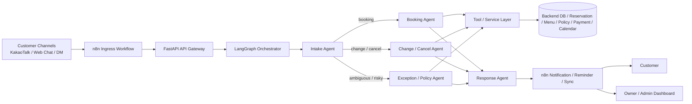
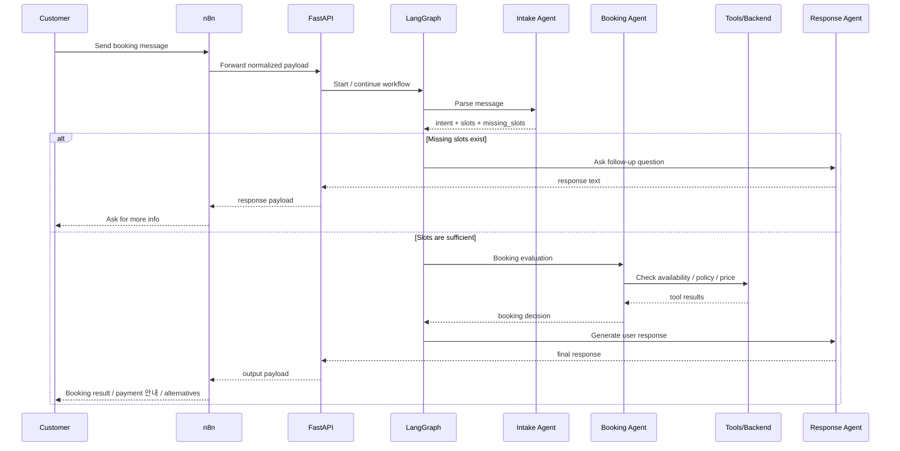

# NailShop AI Ops  
**A Multi-Agent AI Operations System for Small Nail Shops**

> 비정형 고객 문의를 구조화하고, 예약/변경/취소/입금 확인/알림/예외 처리까지 연결하는  
> **네일샵 운영용 멀티에이전트 AI 시스템**

---

## 1. Project Overview

### Why this project?
소규모 네일샵은 고객 문의가 주로 **카카오톡 / 네이버 톡톡 / DM / 문자** 등 다양한 채널로 들어오며,  
문의 형식도 매우 자유롭고 비정형적입니다.

예를 들면:

- “내일 저녁 7시에 젤네일 가능해요?”
- “오프 제거도 같이 하고 싶어요”
- “예약 변경 가능한가요?”
- “입금했는데 확인 부탁드려요”

현재는 이러한 요청을 사장님이 직접 읽고,

- 예약 가능 여부 확인
- 가격/시술 확인
- 변경/취소 처리
- 입금 확인
- 고객 응답
- 일정 관리

를 모두 수작업으로 처리하는 경우가 많습니다.

### Our Solution
이 프로젝트는 고객의 **unstructured request**를 구조화한 뒤,  
예약 운영과 관련된 여러 역할을 **multi-agent system**으로 나누어 처리합니다.

핵심 목표는 다음과 같습니다:

- 고객 메시지 자동 이해
- 예약 관련 정보(slot) 추출
- 예약/변경/취소 분기
- 입금/결제 상태 연동
- 정책 기반 처리
- 예외 상황 human-in-the-loop 전환
- 고객/사장님 알림 자동화

---

## 2. Main Target

### Current Target
- **Nail shop owners / employees**

### Future Expansion
- Cake shops
- Flower shops
- Aesthetic / beauty services
- One-day classes
- Space reservation businesses
- 기타 **custom reservation**이 필요한 소상공인 업종

---

## 3. Core Problem Statement

### Existing Pain Points
- 고객 문의가 **랜덤 포맷**으로 여러 채널에서 들어옴
- 각 문의를 사장님이 수동으로 읽고 해석해야 함
- 예약 / 입금 / 취소 / 변경 프로세스가 서로 분리되어 있음
- 기존 예약 서비스는 **커스텀 요청 처리**가 약함
- 정책 예외 상황(노쇼, 부분 입금, 환불, 당일 예약 등) 대응이 비효율적임

### What we want to automate
- 예약 생성 / 확정
- 예약 변경 / 취소
- 입금 확인
- 고객 응답
- 사장님 알림
- 리마인드 메시지
- 정책 예외 처리

---

## 4. Design Principles

이 프로젝트는 단순 챗봇이 아니라, **stateful multi-agent operations system**입니다.

### Key Principles
1. **LangGraph = core brain**
   - 핵심 멀티에이전트 로직
   - 상태 기반 오케스트레이션
   - 의도 분류 / 슬롯 추출 / 분기 / 예외 판단

2. **n8n = outer automation layer**
   - 외부 시스템 연동
   - webhook / scheduling / notification / sync 자동화
   - 핵심 decision engine은 아님

3. **Backend/DB = source of truth**
   - 예약 상태, 결제 상태, 고객 정보, 메뉴, 정책은 백엔드/DB가 관리
   - LangGraph와 n8n은 이를 활용하지만 저장소의 주체는 아님

4. **Hard constraints = rule-based**
   - 영업시간
   - 예약 가능 시간
   - 선입금 규칙
   - 변경/취소 마감
   - 제거 시 추가 시간
   - 당일 예약 제한  
   → 이런 것은 LLM의 추론이 아니라 **정책/백엔드 로직**으로 처리

5. **Ambiguous/high-risk cases = human-in-the-loop**
   - 정책 충돌
   - 부분 입금 / 중복 입금
   - 애매한 고객 요청
   - 이미지 판단 필요
   - 환불 예외  
   → 자동 확정보다 **사장님 검토 필요**로 넘김

---

## 5. Why LangGraph + n8n?

### Why LangGraph?
우리 프로젝트는 수업 과제이기도 하며, 단순 자동화가 아니라 **멀티에이전트 설계 자체**가 중요합니다.  
따라서 다음이 필요합니다:

- agent별 역할 분리
- shared state 관리
- state-based routing
- 예외 처리 분기
- agent 간 협업 흐름 설계

이 부분은 **LangGraph**가 가장 적합합니다.

### Why n8n?
경진대회 및 실제 서비스 관점에서는 다음이 중요합니다:

- 카카오톡/웹훅/폼 등 외부 입력
- 결제 웹훅 수신
- 예약 리마인드 스케줄링
- 알림 발송
- Notion/CRM/Google Sheets 연동

이런 **외곽 자동화 / integration**는 **n8n**이 매우 강합니다.

### Final Strategy
우리는 다음 구조를 채택합니다:

- **LangGraph** → 핵심 멀티에이전트 두뇌
- **n8n** → 외부 자동화 및 연동
- **FastAPI** → API Gateway / Backend interface
- **LLM provider** → Upstage Solar LLM / OpenAI-compatible abstraction

---

## 6. System Architecture



---

## 7. High-Level Pipeline

### End-to-End Flow
1. 고객이 메시지를 보냄
2. n8n이 메시지를 수신
3. FastAPI가 표준 입력 포맷으로 정리
4. LangGraph가 shared state를 생성/업데이트
5. Intake Agent가 의도 분류 + 슬롯 추출
6. 적절한 agent로 라우팅
7. 각 agent가 backend tools를 호출
8. 정책 및 상태를 반영해 decision 도출
9. Response Agent가 고객/사장님용 응답 생성
10. n8n이 실제 메시지/알림을 발송
11. 필요한 경우 CRM/Notion/Sheets 등과 동기화

---

## 8. Tech Stack

| Layer | Technology | Role |
|---|---|---|
| LLM | OpenAI GPT-4o (현재) / OpenAI-compatible LLM (예정) | 자연어 이해 및 응답 생성 |
| Agent Orchestration | LangGraph | 핵심 stateful multi-agent orchestration |
| LLM App / Prompt Layer | LangChain (optional helper layer) | tool binding / structured output helper |
| API / Backend Interface | FastAPI | ingress / tool API / service gateway |
| Outer Automation | n8n | webhook / scheduling / notification / sync |
| Messaging Channel | KakaoTalk Channel (planned) | 고객 문의 수신/응답 |
| Database | TBD by backend team | 예약 / 고객 / 정책 / 메뉴 저장 |
| Dashboard | TBD by frontend team | 사장님 확인 및 수동 승인 |
| External Integrations | Payment / Calendar / CRM / Notion | 운영 자동화 연결 |

---

## 9. Core Agents

> 중요한 설계 원칙:  
> **모든 기능을 agent로 만들지 않는다.**  
> 진짜 자연어 해석/판단이 필요한 부분만 agent화하고,  
> 나머지는 tool/service/API로 둔다.

### 9.1 Agent Summary Table

| Agent | Main Role | Input | Output | Notes |
|---|---|---|---|---|
| Intake Agent | 고객 메시지 이해, 의도 분류, 슬롯 추출, 라우팅 | raw message, customer context | intent, slots, missing_slots, next route | 시스템의 진입점 |
| Booking Agent | 신규 예약 생성/확정 흐름 관리 | extracted slots, availability, policy | reservation decision, payment need, next action | 예약 happy path 담당 |
| Change / Cancel Agent | 예약 변경/취소 요청 처리 | existing reservation, customer request, policy | change/cancel decision, penalty info, alternatives | 변경/취소 전용 |
| Exception / Policy Agent | 애매한 요청, 정책 충돌, 예외 상황 처리 | current state, flags, policy context | escalation 여부, exception decision | human-in-the-loop 연계 |
| Response Agent | 고객/사장님 응답 생성 | structured decision, context | final response text | 판단보다 표현 담당 |

---

## 10. Agent Responsibilities

### 10.1 Intake Agent
**Purpose**
- 고객 메시지를 이해하고, 어떤 작업인지 분류
- 필요한 slot 추출
- 적절한 다음 agent로 routing

**Key Tasks**
- intent classification
- slot extraction
- missing slot detection
- follow-up 필요 여부 판단
- booking / change / cancel / inquiry / payment 관련 분류

**Example**
Input:
> “내일 7시에 젤네일 가능한가요? 제거도 같이 하고 싶어요.”

Output (conceptually):
- intent = booking
- slots = { date, time, service_name, remove_old_gel }
- missing_slots = []
- next_route = booking_agent

---

### 10.2 Booking Agent
**Purpose**
- 신규 예약 흐름 관리

**Key Tasks**
- availability check
- policy check
- service duration / pricing check
- 선입금 필요 여부 판단
- draft reservation 생성 여부 결정
- 추가 질문 필요 여부 판단

**Typical Decisions**
- 예약 가능
- 예약 불가
- 대체 시간 제안
- 결제 대기 필요
- 사람 검토 필요

---

### 10.3 Change / Cancel Agent
**Purpose**
- 기존 예약의 변경/취소 처리

**Key Tasks**
- 기존 예약 조회
- 변경 가능 여부 판단
- 취소 수수료 / 마감 규정 적용
- 새 슬롯 충돌 검사
- 필요 시 대체 일정 제안

**Typical Decisions**
- 변경 승인
- 변경 불가
- 취소 승인
- 취소 수수료 적용
- 수동 검토 전환

---

### 10.4 Exception / Policy Agent
**Purpose**
- 일반 흐름으로 처리하기 어려운 예외 처리

**Typical Scenarios**
- 요청이 너무 모호함
- 정책끼리 충돌
- 부분 입금 / 중복 입금
- 당일 예약 예외
- 환불 예외
- 이미지 판단 필요
- 사람이 직접 봐야 하는 요청

**Output**
- escalation_required
- escalation_reason
- safe response
- fallback decision

---

### 10.5 Response Agent
**Purpose**
- 구조화된 decision을 고객/사장님이 이해하기 쉬운 메시지로 생성

**Key Principle**
- 새로운 business decision을 내리는 agent가 아니라,
- 이미 내려진 decision을 **자연어로 표현**하는 agent

**Examples**
- 예약 가능 안내
- 대체 시간 제안
- 추가 질문 요청
- 결제 확인 안내
- 사장님 검토 필요 알림

---

## 11. Tools / Services (Not Agents)

다음은 **agent가 아니라** tool/service/API로 두는 것이 더 적절합니다.

| Tool / Service | Purpose | Why not an agent? |
|---|---|---|
| Availability Tool | 예약 가능 시간 조회 | deterministic lookup |
| Reservation Tool | 예약 생성/수정/취소 | DB action |
| Menu / Pricing Tool | 시술 정보, 가격, 소요시간 조회 | structured data lookup |
| Policy Tool | 영업시간, 취소 규정, 선입금 규정 조회 | rule-based |
| Payment Status Tool | 결제/입금 상태 조회 | system integration |
| Notification Tool | 메시지 전송 | action service |
| Customer Lookup Tool | 고객 정보 / 기존 예약 조회 | data retrieval |
| Admin Config Tool | 샵 설정 조회 | structured config |

### Important Note
- **Payment verification** 자체는 LLM agent보다 **webhook + backend service**가 적절함
- **Notification**은 n8n/백엔드 action service가 적절함
- agent는 “판단”, tool/service는 “조회/실행” 중심

---

## 12. Shared State (High-Level)

> 상세 명세는 별도 문서로 작성 예정

LangGraph는 전체 workflow 동안 공통으로 사용하는 **shared state**를 가집니다.

### Core State Fields
- `intent`
- `slots`
- `missing_slots`
- `reservation_status`
- `payment_status`
- `policy_flags`
- `decision`
- `escalation_required`

### Recommended Additional Fields
- `conversation_id`
- `customer_id`
- `channel`
- `raw_message`
- `escalation_reason`
- `response_draft`
- `tool_results`

### Why shared state matters
이 프로젝트는 단순 Q&A가 아니라 **상태 기계(state machine)** 이기 때문에,

- 지금 무슨 상황인지
- 어떤 정보가 모였는지
- 다음 행동이 뭔지
- 사람 검토가 필요한지

를 공통 구조로 들고 가야 합니다.

---

## 13. Main Workflow Scenarios

### 13.1 New Booking Flow



### 13.2 Change / Cancel Flow
1. 고객이 변경/취소 요청
2. Intake Agent가 intent 분류
3. 기존 예약 조회
4. Change / Cancel Agent가 정책 및 가능 여부 검토
5. 필요 시 대체 시간 제안 또는 수수료 안내
6. Response Agent가 결과 안내
7. n8n이 메시지/알림 발송

### 13.3 Payment Flow
1. 고객이 결제/입금
2. 결제 시스템 또는 수동 입력으로 webhook/event 발생
3. n8n이 payment webhook 수신
4. FastAPI가 payment status update
5. 필요 시 LangGraph 재진입
6. 예약 상태를 `pending_payment -> confirmed`로 전환
7. 고객/사장님에게 확정 메시지 발송

### 13.4 Exception Flow
1. ambiguity / policy conflict / risky case 발생
2. Exception / Policy Agent 호출
3. 자동 처리 가능 여부 판단
4. `escalation_required = true` 시 owner review queue로 이동
5. 사장님 대시보드/알림으로 전달

---

## 14. n8n Workflows

n8n은 **핵심 의사결정 엔진이 아니라**, 외부 이벤트와 자동화를 처리하는 레이어입니다.

| Workflow | Trigger | Main Action |
|---|---|---|
| Ingress Workflow | 고객 메시지 도착 | 메시지 수신 → FastAPI 전달 |
| Payment Webhook Workflow | 결제 완료/입금 이벤트 | 결제 상태 업데이트 API 호출 |
| Reminder Workflow | scheduled time / cron | 예약 전 고객/사장님 리마인드 |
| Escalation Alert Workflow | 예외 케이스 발생 | 사장님에게 검토 요청 알림 |
| CRM/Notion Sync Workflow | 예약 이벤트 발생 | 외부 시스템에 로그/기록 동기화 |

### n8n should NOT do
- 핵심 multi-agent logic
- shared state 중심 오케스트레이션
- business decision 판단 주체 역할

---

## 15. Backend Contract Requirements

> 상세 API 명세서는 별도 문서로 작성 예정

백엔드와는 다음 인터페이스가 명확히 정의되어야 합니다.

### Required API Domains
- customer / conversation
- reservation
- availability
- service / menu
- policy
- payment
- notification
- admin config

### Important Collaboration Rule
AI/agent 팀과 backend 팀은 다음을 **미리 통일**해야 합니다:

- field names
- enum values
- success/error response shape
- required vs optional fields
- tool response JSON format

### Example Principle
`status`, `ok`, `result`처럼 제각각 쓰지 말고,  
가능하면 공통 response envelope를 사용:

```json
{
  "success": true,
  "data": {},
  "error": null
}
```

---

## 16. Frontend / Dashboard Expectations

프론트는 별도 담당이지만, AI/agent 시스템과 맞물리기 위해  
다음 UI 기능이 필요합니다.

### Owner/Admin Dashboard
- 예약 목록
- pending payment 목록
- needs review 목록
- agent 추출 결과 확인
- 추천 응답 초안 확인
- 수동 승인 / 수정 / 거절
- 정책 설정
- 메뉴 / 가격 / 소요시간 관리

### Why this matters
이 프로젝트는 완전 자동화보다 **반자동 운영 시스템**에 더 가깝기 때문입니다.

---

## 17. MVP Scope

### In Scope
- 텍스트 기반 고객 문의 처리
- 신규 예약
- 예약 변경
- 예약 취소
- 결제/입금 상태 반영
- 리마인드 알림
- 사장님 알림
- 정책 기반 예외 분기
- owner review flow

### Out of Scope (for initial MVP)
- 이미지 자동 해석 기반 시술 판단
- 여러 디자이너 자동 최적 배정
- 업종 일반화
- 복잡한 다국어 대응
- 자동 환불 처리
- 완전한 CRM 양방향 동기화

---

## 18. Future Work

### Business Generalization
- 네일샵 외 업종 확장
- 업종별 schema/policy 변경 가능한 configuration layer 필요

### Designer Scheduling
- 현재는 단일 사장/디자이너 가정
- 추후 복수 디자이너 스케줄링 지원

### Image Analysis
- 현재는 image 저장 + 수동 판단
- 추후 문맥 기반 이미지 해석 모델 도입

### Others
- 결제 수단 확대
- 외국인 고객용 자동 번역
- Notion / CRM 고도화 연동

---

## 19. Suggested Repository Structure

```bash
project-root/
├── README.md
├── docs/
│   ├── architecture.md
│   ├── shared-state-spec.md
│   ├── agent-io-spec.md
│   ├── api-contracts.md
│   └── workflow-scenarios.md
├── backend/                  # backend team
│   └── ...
├── frontend/                 # frontend team
│   └── ...
├── agent/
│   ├── graph/
│   │   ├── state.py
│   │   ├── nodes.py
│   │   ├── router.py
│   │   └── workflow.py
│   ├── agents/
│   │   ├── intake_agent.py
│   │   ├── booking_agent.py
│   │   ├── change_cancel_agent.py
│   │   ├── exception_policy_agent.py
│   │   └── response_agent.py
│   ├── tools/
│   │   ├── availability_tool.py
│   │   ├── reservation_tool.py
│   │   ├── payment_tool.py
│   │   ├── policy_tool.py
│   │   └── menu_tool.py
│   ├── prompts/
│   │   └── ...
│   └── tests/
│       └── ...
├── workflows/
│   └── n8n/
│       ├── ingress.json
│       ├── payment_webhook.json
│       ├── reminder.json
│       └── escalation_alert.json
└── samples/
    ├── conversation_examples/
    └── dummy_data/
```

---

## 20. Team Collaboration Guidelines

### AI / Agent Team
- shared state 설계
- agent 역할 정의
- agent I/O 정의
- LangGraph workflow 구현
- prompt / structured output 설계
- exception routing 설계

### Backend Team
- DB schema
- API endpoints
- business logic / policies
- payment / reservation / availability services

### Frontend Team
- customer-facing UI
- owner/admin dashboard
- review / approval interface
- 상태 시각화

### Shared Responsibility
- JSON contract alignment
- enum / field naming consistency
- end-to-end integration testing

---

## 21. Demo Scenarios

### Scenario 1: New Booking
> “내일 저녁 7시에 젤네일 가능해요? 제거도 같이 하고 싶어요.”

Expected system behavior:
- booking intent 인식
- date/time/service/remove_old_gel 추출
- 예약 가능 여부 조회
- 가능 시 예약 draft 또는 결제 안내
- 불가 시 대체 시간 제안

### Scenario 2: Change Request
> “이번 주 금요일 예약을 토요일로 변경하고 싶어요.”

Expected system behavior:
- change intent 인식
- 기존 예약 조회
- 새 슬롯 availability 확인
- 변경 가능 여부 안내

### Scenario 3: Cancel Request
> “예약 취소할게요.”

Expected system behavior:
- 예약 식별
- 취소 가능 여부 / 수수료 정책 적용
- 취소 처리 또는 owner review

### Scenario 4: Payment Confirmation
> “입금했어요 확인 부탁드려요.”

Expected system behavior:
- payment-related intent 인식
- 결제 상태 조회 / webhook 반영
- 예약 상태 업데이트
- 확정 메시지 발송

### Scenario 5: Exception Case
> “오늘 밤 11시에 가능할까요?”

Expected system behavior:
- 영업시간 외 요청 감지
- policy flag 설정
- 자동 거절 or 예외 검토 안내

---

## 22. Current Frozen Design Decisions

아래는 현재까지 팀 내부 합의가 필요한/또는 합의된 핵심 방향입니다.

- LangGraph is the **core orchestration/agent brain**
- n8n is used **only for outer automation and integrations**
- Backend DB is the **source of truth**
- Not every box is an agent
- Payment verification and notification are **tools/services**, not core agents
- Hard constraints are **rule-based**, not LLM-decided
- Human-in-the-loop is required for risky/ambiguous cases
- Core agents are:
  - Intake Agent
  - Booking Agent
  - Change / Cancel Agent
  - Exception / Policy Agent
  - Response Agent

---

## 23. Next Documentation to Create

이 README 다음으로 팀에서 반드시 만들어야 할 문서:

1. **Shared State Spec**
2. **Agent I/O Spec**
3. **Tool / API Contract Spec**
4. **Workflow Scenario Spec**
5. **Prompt / Structured Output Design**
6. **Integration Test Cases**

---

## 24. Summary

이 프로젝트는 단순 FAQ 챗봇이 아니라,  
**비정형 고객 문의를 구조화하고 실제 운영 업무까지 연결하는 stateful multi-agent AI system**입니다.

핵심은 다음과 같습니다:

- **LangGraph**로 멀티에이전트 오케스트레이션
- **n8n**으로 외부 자동화 및 integration
- **FastAPI + backend services**로 비즈니스 로직 및 데이터 관리
- **owner review flow**를 포함한 실전형 운영 지원
- 현재는 **nail shop MVP**, 이후 다양한 custom reservation business로 확장 가능
