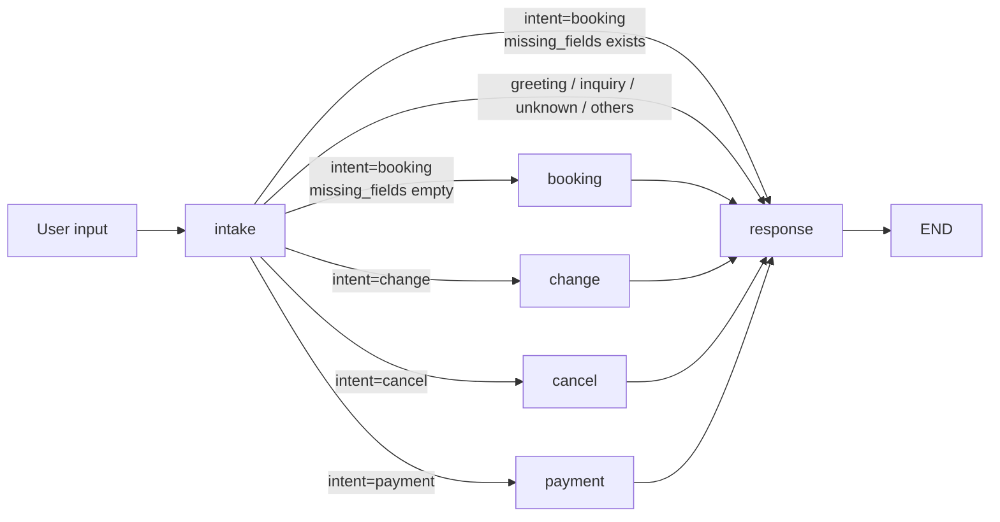
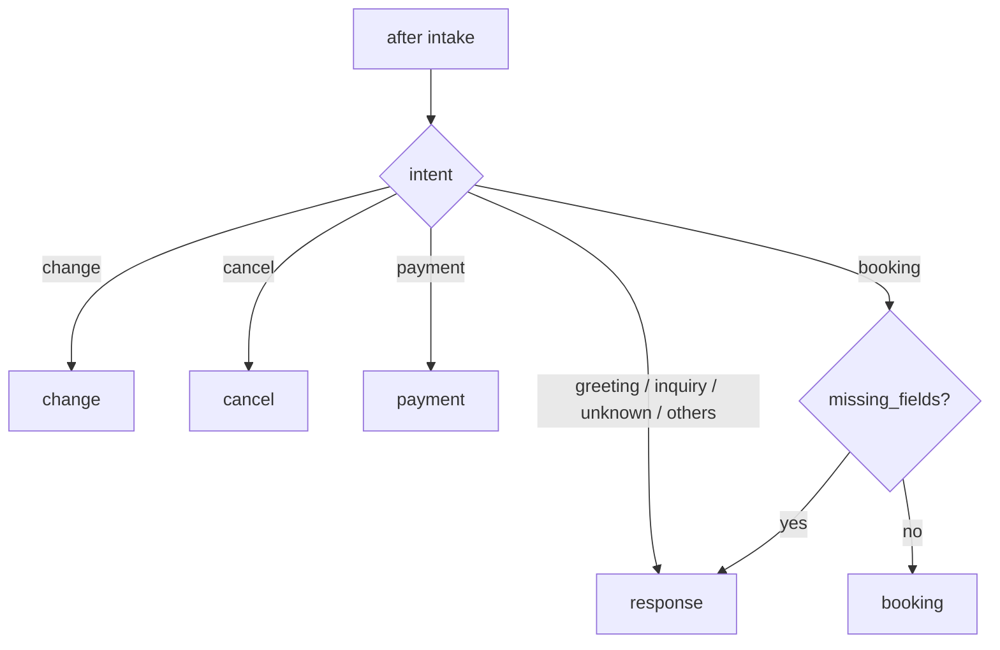

# LangGraph 네일샵 예약 에이전트 아키텍처

이 문서는 `agent/` 폴더의 실제 코드 기준으로 LangGraph 워크플로우를 정리한 발표용 자료입니다.

핵심 관찰:
- 그래프 진입점은 `intake` 하나입니다.
- 조건부 분기는 `add_conditional_edges("intake", route_after_intake, ...)` 에만 있습니다.
- `booking`, `change`, `cancel`, `payment` 는 모두 마지막에 `response` 로 합류합니다.
- 코드의 실제 state key 는 문서/기획 용어와 조금 다릅니다.
  - `missing_slots` 개념은 코드에서 `missing_fields`
  - `policy_flags` 개념은 코드에서 `policy_check_results`
  - `reservation_status` 개념은 코드에서 `booking_status`
  - `payment_status` 는 독립 key 가 없고 `booking_status` / `next_action` / backend 예약 응답으로 표현됩니다.

---

## 1. 그래프 한눈에 보기

### 라우팅 규칙
- `route_after_intake()` 가 `intent` 와 `missing_fields` 를 보고 다음 노드를 결정합니다.
- `booking` 인 경우에만 `missing_fields == []` 이면 `booking` 으로 진행하고, 아니면 바로 `response` 로 갑니다.
- `change`, `cancel`, `payment` 는 각각 전용 노드로 분기합니다.
- `greeting`, `inquiry`, `unknown` 은 모두 `response` 로 갑니다.

---

## 2. StateGraph 구조

### 정의 파일
- [workflow.py](/home/sallysooo/Desktop/Nailgent/agent/agent/graph/workflow.py#L15)
- [state.py](/home/sallysooo/Desktop/Nailgent/agent/agent/graph/state.py#L19)
- [router.py](/home/sallysooo/Desktop/Nailgent/agent/agent/graph/router.py#L7)

### 노드 정의
- `intake`
- `booking`
- `change`
- `cancel`
- `payment`
- `response`

### edge 정의
- `intake -> {response|booking|change|cancel|payment}` 는 conditional edge
- `booking -> response`
- `change -> response`
- `cancel -> response`
- `payment -> response`
- `response -> END`

---

## 3. LangGraph State 키 분석

실제 state 타입은 `ReservationState(TypedDict)` 입니다.

| Key | Type | 의미 | 주로 읽는 노드 | 주로 쓰는 노드 |
|---|---|---|---|---|
| `user_input` | `str` | 사용자 원문 입력 | `intake` | 외부 입력 |
| `response_draft` | `str` | 최종 응답 초안 | `booking`, `change`, `cancel`, `payment`, `response` | 거의 모든 노드 |
| `intent` | `str` | 의도 라벨 | `router`, `booking`, `change`, `cancel`, `payment`, `response` | `intake` |
| `slots` | `BookingSlots` | 예약 슬롯 묶음 | `intake`, `booking`, `change`, `cancel`, `payment` | `intake` |
| `missing_fields` | `List[str]` | 누락된 예약 필드 목록 | `router` | `intake` |
| `is_bookable` | `bool` | 예약 가능 여부 플래그 | downstream / test | `intake`, `booking` |
| `booking_status` | `str` | 예약 처리 상태 | downstream / response | `intake`, `booking`, `change`, `cancel`, `payment` |
| `next_action` | `str` | 다음 행동 힌트 | downstream / response | `intake`, `booking`, `change`, `cancel`, `payment` |
| `policy_check_results` | `dict` | 정책/백엔드 검증 결과 | `response`, 외부 연동 | `booking`, `change`, `cancel`, `payment` |
| `history` | `List[dict]` | 대화 이력 | 현재 코드상 미사용 | 외부 입력만 존재 |
| `designer` | `str`/`None` | 담당자 정보 | `booking` | 외부 입력에서 전달 가능 |

### 중요한 구현 메모
- `ReservationState` 에 `designer` 는 선언되어 있지 않지만 `booking_node()` 에서 `state.get("designer")` 로 읽습니다.
- `history` 는 state 에 존재하지만 현재 노드들이 업데이트하지 않습니다.
- `policy_check_results` 는 “정책 플래그”의 실제 저장소 역할을 합니다.
- `booking_status` 가 사실상 예약 상태의 중심 키입니다.

---

## 4. Intake Agent 가 수집하는 slot

### 소스
- [schema.py](/home/sallysooo/Desktop/Nailgent/agent/agent/agents/schema.py#L7)
- [intake_agent.py](/home/sallysooo/Desktop/Nailgent/agent/agent/agents/intake_agent.py#L84)

### 실제 수집 slot
Intake Agent 는 `BookingSlots` 에 다음 값을 채웁니다.

| Slot | 의미 | 정규화 규칙 |
|---|---|---|
| `name` | 고객 성함 | 한글 이름 추출 |
| `phone_num` | 전화번호 | `010-XXXX-XXXX` 형태로 정규화 |
| `off_removal` | 젤 제거 여부 | O/X, 문장 기반 true/false 추론 |
| `reserve_date` | 예약 날짜 | `YYYY-MM-DD`, 상대 날짜(오늘/내일/모레) 해석 |
| `reserve_time` | 예약 시간 | `HH:MM`, `오후 3시` 같은 표현도 해석 |
| `service_code` | 시술 코드 | `GEL_BASIC`, `GEL_NAIL`, `PEDICURE` |
| `past_visit` | 재방문 여부 | 처음 방문/재방문 추론 |

### 인텐트 분류
`IntakeAgent` 는 아래 intent 를 구분합니다.
- `greeting`
- `booking`
- `inquiry`
- `change`
- `cancel`
- `payment`
- `unknown`

### follow-up 기준
- booking intent 에서 필수 slot 이 하나라도 빠지면 `need_followup=True`
- 누락 필드는 `missing_fields` 에 들어갑니다.
- `followup_question` 은 누락 필드에 따라 한국어 질문으로 생성됩니다.

### multi-turn memory
- `intake_node()` 는 새로 추출한 슬롯을 기존 `state["slots"]` 와 `merge_slots()` 로 합칩니다.
- 이 때문에 이전 turn 에서 모은 정보가 다음 turn 에 이어집니다.

---

## 5. 노드별 역할

### 5.1 `intake_node`
파일:
- [nodes.py](/home/sallysooo/Desktop/Nailgent/agent/agent/graph/nodes.py#L66)

역할:
- 사용자 입력을 분석한다.
- `IntakeAgent.run()` 을 호출해 intent 와 slot 을 추출한다.
- 기존 `slots` 와 merge 한다.
- 누락 필드를 다시 계산한다.
- booking 이 아니면 대부분 바로 응답용 state 를 만든다.

업데이트하는 key:
- `intent`
- `slots`
- `missing_fields`
- `is_bookable`
- `booking_status`
- `next_action`
- `response_draft`

핵심 분기:
- 빈 입력이면 greeting 응답
- `intent != "booking"` 이면 `missing_fields=[]`, `next_action="respond_only"`
- booking 이고 `missing_count >= 3` 이면 `BOOKING_FORM_GUIDE`
- booking 이고 `missing_count > 0` 이면 follow-up 질문
- booking 이고 필수 정보가 충분하면 `next_action="validate_booking"`

### 5.2 `booking_node`
파일:
- [nodes.py](/home/sallysooo/Desktop/Nailgent/agent/agent/graph/nodes.py#L132)

역할:
- 신규 예약 happy path 를 처리한다.
- 백엔드의 shop info 와 schedule 을 조회한다.
- `PolicyEngine` 으로 영업시간/충돌 여부를 검증한다.
- 가능하면 백엔드에 예약을 생성한다.
- 불가능하면 대체 시간 추천을 만든다.

업데이트하는 key:
- `is_bookable`
- `booking_status`
- `next_action`
- `response_draft`
- `policy_check_results`

상태 흐름:
- 입력 날짜/시간이 없으면 `ask_followup`
- shop info 조회 실패 시 `booking_status="backend_error"`
- schedule 조회 실패 시 `booking_status="backend_error"`
- 정책 통과 시 `booking_status="pending_payment"`
- 정책 실패 시 `booking_status="rejected"`

### 5.3 `change_node`
파일:
- [nodes.py](/home/sallysooo/Desktop/Nailgent/agent/agent/graph/nodes.py#L265)

역할:
- name 없으면 즉시 성함 요청 followup 반환.
- `find_reservations()` 로 고객/일자/시간/시술로 매칭한다.
- 매칭된 예약을 `PATCH /api/v1/bookings/{id}` 로 실제 변경한다.

업데이트하는 key:
- `booking_status`
- `next_action`
- `response_draft`
- `policy_check_results`

상태 흐름:
- name 없음: 성함 요청 `ask_followup`
- 매칭 예약 없음: `ask_followup`
- 새 일정 미제공: `pending_review`
- 변경 성공: `booking_status="updated"`
- 변경 실패: `booking_status="backend_error"`

### 5.4 `cancel_node`
파일:
- [nodes.py](agent/graph/nodes.py)

역할:
- name 없으면 즉시 성함 요청 followup 반환.
- `find_reservations()` 로 취소 대상 예약을 찾는다.
- `DELETE /api/v1/bookings/{id}` 로 실제 취소한다.

업데이트하는 key:
- `booking_status`
- `next_action`
- `response_draft`
- `policy_check_results`

상태 흐름:
- name 없음: 성함 요청 `ask_followup`
- 매칭 예약 없음: `ask_followup`
- 취소 성공: `booking_status="cancelled"`
- 취소 실패: `booking_status="backend_error"`

### 5.5 `payment_node`
파일:
- [nodes.py](agent/graph/nodes.py)

역할:
- name 없으면 즉시 성함 요청 followup 반환.
- `GET /api/v1/bookings` 로 전체 예약 조회 후 이름으로 필터.
- 가장 최근 예약의 `payment_status == "PAID"` 여부로 고정 메시지 반환.

업데이트하는 key:
- `booking_status`
- `next_action`
- `response_draft`

상태 흐름:
- name 없음: 성함 요청 `ask_followup`
- 결제 확인: `booking_status="payment_confirmed"`, "✅ 결제가 확인되었습니다!"
- 미결제: `booking_status="pending_payment"`, "⚠️ 아직 결제가 확인되지 않았습니다."

### 5.6 `response_node`
파일:
- [nodes.py](/home/sallysooo/Desktop/Nailgent/agent/agent/graph/nodes.py#L424)

역할:
- 이미 만들어진 `response_draft` 가 있으면 그대로 반환한다.
- 없으면 intent 에 따라 fallback 응답을 만든다.

업데이트하는 key:
- `response_draft`

---

## 6. 중요한 컬럼이 흐름에 미치는 영향

### `missing_fields`
- `intake_node()` 에서 계산됩니다.
- `route_after_intake()` 는 booking intent 에서 `missing_fields` 가 있으면 `response` 로 돌립니다.
- 즉, `missing_fields` 는 booking 노드로 가기 전에 follow-up 이 필요한지 결정합니다.

### `policy_check_results`
- booking/change/cancel/payment 의 “판정 메타데이터”를 담습니다.
- booking 에서는 아래를 주로 넣습니다.
  - `source`
  - `business_hours`
  - `booked_slots`
  - `deposit_amount`
  - `backend_status`
  - `reservation_result`
- change/cancel/payment 에서는 `matched_reservations` 를 넣습니다.
- 따라서 발표용으로는 `policy_flags` 보다 `policy_check_results` 가 실제 구현명입니다.

### `booking_status`
- 예약/변경/취소/입금의 현재 처리 상태를 나타내는 사실상의 중심 상태값입니다.
- 주요 값:
  - `N/A`
  - `backend_error`
  - `pending_payment`
  - `rejected`
  - `pending_review`

### `payment_status`
- 독립된 state key 는 없습니다.
- 실제로는 `booking_status="pending_payment"` 와 `next_action="notify_success"` 가 입금 안내/대기 흐름을 표현합니다.
- backend 에 저장되는 예약 데이터는 `visit_status` 와 `deposit_amount` 로 후속 관리됩니다.

### `reservation_status`
- 코드에는 별도 state key 가 없고, 아래 세 층으로 분산되어 있습니다.
  - LangGraph state: `booking_status`
  - backend 예약 목록: `visit_status`
  - backend 생성 응답: `reservation_result`

---

## 7. 조건부 분기 상세

### `route_after_intake()`
파일:
- [router.py](/home/sallysooo/Desktop/Nailgent/agent/agent/graph/router.py#L7)

### 해석
- `change`, `cancel`, `payment` 는 intent 만으로 바로 전용 노드로 갑니다.
- `booking` 은 missing field 유무가 추가 조건입니다.
- 그 외 intent 는 모두 `response` 로 정리됩니다.

---

## 8. 백엔드 API / Tool 호출 지점

### 8.1 `BackendClient.get_shop_info()`
호출 위치:
- [nodes.py](/home/sallysooo/Desktop/Nailgent/agent/agent/graph/nodes.py#L157)

실제 호출:
- `GET /api/v1/shopinfo`

주의:
- 현재 백엔드 레포에서는 `shopinfo` 엔터티/레포지토리는 있지만, 해당 HTTP 컨트롤러는 보이지 않습니다.
- 그래서 이 호출은 실제 배포 시점에는 mock fallback 또는 추후 구현될 API 를 전제로 읽는 것이 맞습니다.

의도:
- 예약 메시지 텍스트
- 영업시간
- 예약금
- 계좌 정보
- 정책 텍스트

### 8.2 `BackendClient.get_schedule(date)`
호출 위치:
- [nodes.py](/home/sallysooo/Desktop/Nailgent/agent/agent/graph/nodes.py#L172)

실제 호출:
- `GET /api/v1/bookings/schedule?date=YYYY-MM-DD`

의도:
- 해당 날짜의 영업시간
- 이미 예약된 시간대
- 정책 엔진 검증용 데이터

### 8.3 `BackendClient.create_reservation(payload)`
호출 위치:
- [nodes.py](/home/sallysooo/Desktop/Nailgent/agent/agent/graph/nodes.py#L199)

실제 호출:
- `POST /api/v1/bookings`

전송 payload 핵심 필드:
- `name`
- `phone_num`
- `reserve_date`
- `reserve_time` (`HH:MM-HH:MM` 범위 문자열)
- `estimated_duration_min`
- `service`
- `off_removal`
- `deposit_amount`
- `designer`

의도:
- 예약 생성
- customer 생성 또는 재사용
- 예약 저장

### 8.4 `BackendClient.list_reservations(page, size)`
호출 위치:
- `find_reservations()` 내부

실제 호출:
- `GET /api/v1/bookings?page=1&size=100`

응답에서 읽는 주요 필드:
- `bookings[].id`
- `bookings[].name`
- `bookings[].service`
- `bookings[].reserveDate`
- `bookings[].reserveTime`
- `bookings[].offRemoval`
- `bookings[].designer`
- `bookings[].visitStatus`

의도:
- change / cancel / payment 대상 후보 찾기

### 8.5 `BackendClient.find_reservations(...)`
사용 노드:
- `change_node`
- `cancel_node`
- `payment_node`

필터 조건:
- `name`
- `reserve_date`
- `reserve_time`
- `service`
- `visit_status` (`payment_node` 에서는 `PENDING`)

---

## 9. Policy Engine 역할

### 파일
- [policy_engine.py](/home/sallysooo/Desktop/Nailgent/agent/agent/tools/policy_engine.py#L1)

### 역할
`PolicyEngine` 은 LLM 이 아니라 deterministic rule engine 입니다.

1. `calculate_duration(service_code, needs_removal)`
   - 서비스 소요 시간을 계산합니다.
   - 제거 필요 시 `REMOVAL_ADDON` 을 더합니다.

2. `validate_reservation(date_str, time_str, duration, booked_slots, business_hours)`
   - 요일 휴무
   - 영업시간 범위
   - 기존 예약과의 시간 충돌
   를 검사합니다.

3. `get_available_recommendations(business_hours, booked_slots, duration)`
   - 예약 불가 시 가능한 시간대를 추천합니다.

### booking 흐름에서의 영향
- `check["valid"] == True`
  - 예약 생성으로 진행
  - `booking_status="pending_payment"`
- `check["valid"] == False`
  - 예약 거절
  - `booking_status="rejected"`
  - 대체 시간 추천 생성

---

## 10. backend API contract 기준으로 본 데이터 흐름

### booking flow
1. `intake_node()` 가 intent/slots/missing_fields 를 만든다.
2. `booking_node()` 가 `shopinfo` 를 조회한다.
3. `booking_node()` 가 `schedule` 을 조회한다.
4. `PolicyEngine` 이 시간 검증을 한다.
5. 통과하면 `create_reservation()` 으로 예약을 생성한다.
6. `policy_check_results.reservation_result` 에 백엔드 응답이 저장된다.
7. `response_node()` 가 최종 메시지를 반환한다.

### change / cancel / payment flow
1. `intake_node()` 가 intent 를 분류한다.
2. 전용 노드가 `find_reservations()` 로 대상 예약을 찾는다.
3. 현재 코드에서는 실제 수정/취소/입금 확정 API 를 호출하지 않고, 사장님 확인 메시지로 정리한다.
4. 관련 후보는 `policy_check_results.matched_reservations` 에 저장된다.

---

## 11. 발표용 요약

- **Intake Agent** 는 `name`, `phone_num`, `off_removal`, `reserve_date`, `reserve_time`, `service_code`, `past_visit` 를 수집합니다.
- **Booking** 은 shop info + schedule + policy engine + reservation create 까지 담당합니다.
- **Change / Cancel** 는 백엔드 PATCH/DELETE API 를 호출해 실제 변경/취소를 처리합니다. name 없으면 성함부터 요청합니다.
- **Payment** 는 `GET /api/v1/bookings` 로 결제 상태를 조회해 고정 메시지를 반환합니다. Toss 웹훅 연동 시 자동화 예정입니다.
- **Policy engine** 은 영업시간, 휴무일, 시간 충돌, 대체 시간 추천을 맡습니다.
- **실제 branching 은 intake 후 1회** 만 있습니다.
- **핵심 상태 키** 는 `intent`, `slots`, `missing_fields`, `booking_status`, `next_action`, `policy_check_results`, `response_draft` 입니다.

