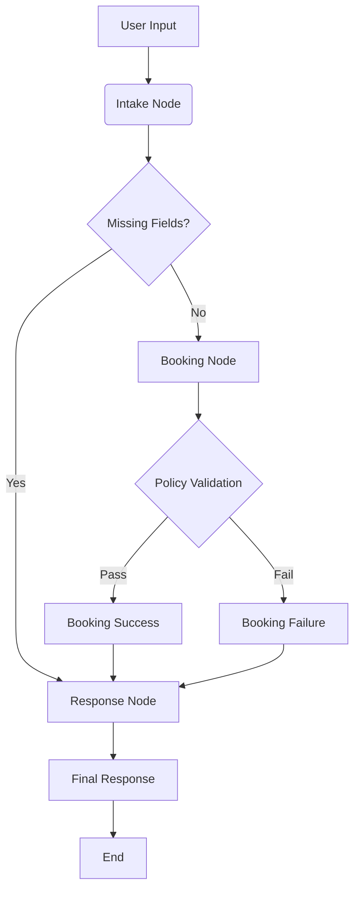

# NailShop AI Ops - Version 1 Development Documentation

## 1. Project Overview
- 비정형 고객 문의를 구조화하여 네일샵의 예약 프로세스를 자동화하는 멀티에이전트 시스템의 초기 버전(Version 1) 개발 프로젝트
- 예약 등록(Booking)의 핵심 기능을 우선 구현하며, LangGraph를 기반으로 한 상태 중심(State-driven) 아키텍처를 채택함

## 2. Directory Structure
```
agent/
├── graph/               # LangGraph 오케스트레이션 레이어
│   ├── state.py         # 공유 상태(Shared State) 정의
│   ├── nodes.py         # 워크플로우 각 단계의 실행 노드
│   ├── router.py        # 노드 간 이동 경로를 결정하는 로직
│   └── workflow.py      # 전체 그래프(StateGraph) 조립 및 정의
├── agents/              # 지능형 에이전트 레이어 (LLM 기반)
│   ├── schema.py        # 데이터 구조 정의 (Pydantic 모델)
│   └── intake_agent.py  # 입력 분석 및 정보 추출 에이전트
├── tools/               # 결정론적 도구 및 비즈니스 로직 레이어
│   └── policy_engine.py # 영업 정책 및 규칙 검증 엔진
└── tests/               # 단위 및 통합 테스트 스크립트
```

## 3. Core Component Analysis

### 3.1. Data Schema (`schema.py`)
- **BookingSlots**: 예약에 필요한 필수/선택 정보를 담는 데이터 모델 (이름, 전화번호, 시술 종류, 날짜, 시간 등)
- **IntakeResult**: 입력 메시지에 대한 분석 결과 모델 (의도(Intent), 추출된 슬롯, 누락된 필드, 후속 질문 포함)

### 3.2. Shared State (`state.py`)
- **ReservationState**: 워크플로우 전반에서 공유되는 메모리 객체 (사용자 입력, 추출된 정보, 예약 가능 여부, 응답 초안 등 관리)

### 3.3. Policy Engine (`policy_engine.py`)
- LLM의 추론에 의존하지 않는 확정적 비즈니스 로직
- 영업시간(10:00-22:00), 휴무일(월요일), 시술별 소요 시간 계산 기능 포함

## 4. Workflow Flow (Version 1)
1. **User Input**: 고객의 메시지(자연어 또는 양식) 수신
2. **Intake Agent**: 메시지 분석, 의도 분류 및 정보 추출
3. **Condition Check**: 필수 정보 누락 여부 확인
   - 누락 시: 후속 질문 생성 후 사용자에게 회신
   - 충족 시: Policy Engine으로 전달
4. **Validation**: 정책 기반 예약 가능 여부 및 일정 충돌 검증
5. **Response**: 최종 결과(확정/거절/대체 시간 제안) 안내

## 5. Implementation Details

### 5.1. API Management
- **.env**: API Key 등 민감 정보를 환경 변수로 관리함.
- **dotenv**: `load_dotenv()`를 호출하여 파이썬 런타임에 환경 변수를 주입함.

### 5.2. Graph Orchestration (`nodes.py`, `workflow.py`)
- **Nodes**: 각 단계별 독립적인 실행 단위.
  - `intake_node`: LLM을 통한 입력 분석.
  - `booking_node`: Policy Engine 연동 및 예약 가능 여부 판정.
  - `response_node`: 최종 메시지 작성.
- **Edges & Router**: 노드 간의 이동 경로 및 조건부 분기 정의.
  - 정보 부족 시 `response_node`로 직행하여 질문 투척.
  - 정보 충족 시 `booking_node`로 이동하여 검증 진행.

## 6. Visual Workflow (Mermaid)



## 7. Workflow Breakdown (PDF vs Code)

| 단계 | 역할 | PDF 계획 (Reference) | 실제 구현 (Code) |
|---|---|---|---|
| **Intake** | 의도 파악 및 정보 추출 | "의도 분류 및 슬롯 추출" | `IntakeAgent` (LLM + Structured Output) |
| **Routing** | 조건부 흐름 제어 | "Missing field 있으면 follow-up" | `router.py` (Conditional Edges) |
| **Validation** | 정책 검증 | "Policy engine과 대조" | `PolicyEngine` (Python Logic) |
| **Booking** | 예약 확정/거절 | "예약 등록 여부 결정" | `booking_node` (State Update) |
| **Response** | 자연어 응답 생성 | "고객 응답 흐름" | `response_node` (Message Drafting) |


