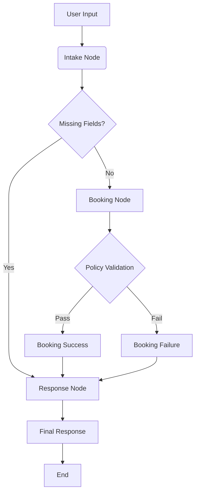

# NailShop AI Ops - Version 1 Development Documentation

## 1. Project Overview
- 비정형 고객 문의를 구조화하여 네일샵의 예약 프로세스를 자동화하는 멀티에이전트 시스템의 초기 버전(Version 1) 개발 프로젝트
- 예약 등록(Booking)의 핵심 기능을 우선 구현하며, LangGraph를 기반으로 한 상태 중심(State-driven) 아키텍처를 채택함

## 2. Directory Structure
```
agent/
├── graph/               # LangGraph Orchestration Layer
│   ├── state.py         # Shared State Definition
│   ├── nodes.py         # Workflow Step Execution Nodes
│   ├── router.py        # Node Transition Routing Logic
│   └── workflow.py      # Complete Graph Assembly
├── agents/              # Intelligent Agent Layer (LLM-based)
│   ├── schema.py        # Data Structure Definitions (Pydantic Models)
│   └── intake_agent.py  # Input Analysis and Information Extraction Agent
├── tools/               # Deterministic Tools and Business Logic Layer
│   └── policy_engine.py # Business Policy and Rule Validation Engine
└── tests/               # Unit and Integration Test Scripts
```

## 3. Core Component Analysis

### 3.1. Data Schema (`schema.py`)
- **BookingSlots**: 예약에 필요한 필수/선택 정보를 담는 데이터 모델 (이름, 전화번호, 시술 종류, 날짜, 시간 등)
- **IntakeResult**: 입력 메시지에 대한 분석 결과 모델 (의도(Intent), 추출된 슬롯, 누락된 필드, 후속 질문 포함)

### 3.2. Shared State (`state.py`)
- **ReservationState**: 워크플로우 전반에서 공유되는 메모리 객체 (사용자 입력, 추출된 정보, 예약 가능 여부, 응답 초안 등 관리)

### 3.3. Policy Engine (`policy_engine.py`)
- LLM의 추론에 의존하지 않는 확정적 비즈니스 로직
- 영업시간(10:00-22:00), 휴무일(월요일), 시술별 소요 시간 계산 기능 포함

## 4. Workflow Flow (Version 1)
1. **User Input**: 고객의 메시지(자연어 또는 양식) 수신
2. **Intake Agent**: 메시지 분석, 의도 분류 및 정보 추출
3. **Condition Check**: 필수 정보 누락 여부 확인
   - 누락 시: 후속 질문 생성 후 사용자에게 회신
   - 충족 시: Policy Engine으로 전달
4. **Validation**: 정책 기반 예약 가능 여부 및 일정 충돌 검증
5. **Response**: 최종 결과(확정/거절/대체 시간 제안) 안내

## 5. Implementation Details

### 5.1. API Management
- **.env**: API Key 등 민감 정보를 환경 변수로 관리
- **dotenv**: `load_dotenv()`를 호출하여 파이썬 런타임에 환경 변수를 주입

### 5.2. Graph Orchestration (`nodes.py`, `workflow.py`)
- **Nodes**: 각 단계별 독립적인 실행 단위
  - `intake_node`: LLM을 통한 입력 분석
  - `booking_node`: Policy Engine 연동 및 예약 가능 여부 판정
  - `response_node`: 최종 메시지 작성
- **Edges & Router**: 노드 간의 이동 경로 및 조건부 분기 정의
  - 정보 부족 시 `response_node`로 직행하여 질문 투척
  - 정보 충족 시 `booking_node`로 이동하여 검증 진행

## 6. Visual Workflow (Mermaid)



## 7. Workflow Breakdown (PDF vs Code)

| 단계 | 역할 | PDF 계획 (Reference) | 실제 구현 (Code) |
|---|---|---|---|
| **Intake** | 의도 파악 및 정보 추출 | "의도 분류 및 슬롯 추출" | `IntakeAgent` (LLM + Structured Output) |
| **Routing** | 조건부 흐름 제어 | "Missing field 있으면 follow-up" | `router.py` (Conditional Edges) |
| **Validation** | 정책 검증 | "Policy engine과 대조" | `PolicyEngine` (Python Logic) |
| **Booking** | 예약 확정/거절 | "예약 등록 여부 결정" | `booking_node` (State Update) |
| **Response** | 자연어 응답 생성 | "고객 응답 흐름" | `response_node` (Message Drafting) |

## 8. Backend Integration & Slot Calculation

### 8.1. API Design
- 백엔드로부터 해당 날짜의 **전체 영업시간** 및 **이미 예약된 슬롯 리스트**를 제공받아 에이전트가 직접 가용 시간을 계산함
- Input: `date` (YYYY-MM-DD)
- Output: `business_hours` (start, end), `booked_slots` (start, end, duration)

### 8.2. Gap Finding Algorithm
1. 하루의 영업시간을 1분 단위의 타임라인 배열로 생성
2. 기존 예약된 시간대를 타임라인 상에서 '사용 중'으로 표시
3. 고객이 요청한 시술의 소요 시간(Duration)만큼 연속된 빈 공간(0)을 찾음
4. 예약 불가 시, 위 알고리즘을 통해 계산된 대체 시간대(상위 3개)를 고객에게 자동으로 제안함

## 9. Backend Connection Points

Version 1에서 agent가 실제로 백엔드와 만나는 지점은 두 곳입니다.

### 9.1 예약 스케줄 조회
- 목적: 특정 날짜의 영업시간과 이미 예약된 시간대를 가져오기
- 요청: `GET /api/v1/bookings/schedule?date=YYYY-MM-DD`
- 사용 위치: `booking_node`
- 사용 이유:
  - 고객이 요청한 시간과 기존 예약이 겹치는지 검사
  - 대체 가능한 시간을 계산

### 9.2 예약 생성
- 목적: 예약이 가능하다고 판단되면 백엔드에 예약을 등록하기
- 요청: `POST /api/v1/bookings`
- 사용 위치: `booking_node`
- 사용 이유:
  - 예약 정보를 백엔드 DB에 저장
  - 고객/대시보드가 나중에 같은 예약 데이터를 보게 하기

### 9.3 샵 정보 조회
- 목적: 예약금, 영업시간 안내 문구, 정책 문구를 가져오기
- 요청: `GET /api/v1/shopinfo`
- 사용 위치: `booking_node`
- 사용 이유:
  - 예약금 안내
  - 고객에게 보여줄 고정 문구 구성

---

## 10. Actual Runtime Flow

아래 순서대로 agent가 동작합니다.

### Step 1. 고객 메시지 입력
예:
> "내일 오후 3시 김지수 010-1111-2222 젤네일 예약요. 제거는 없어요. 처음 가요."

### Step 2. Intake Agent 실행
`intake_agent.py`가 메시지를 읽고 다음을 추출합니다.
- intent
- name
- phone_num
- reserve_date
- reserve_time
- service_code
- off_removal
- past_visit

### Step 3. 부족한 정보 확인
필수 슬롯이 비어 있으면 바로 follow-up 질문을 생성합니다.
- 이름이 없으면 이름만 묻기
- 날짜/시간이 없으면 날짜와 시간을 묻기
- 정보가 너무 적으면 예약 양식 전체를 안내하기

### Step 4. Booking Node 실행
필수 정보가 충분하면 `booking_node`로 이동합니다.

이 단계에서 agent는 다음 순서를 따릅니다.
1. `GET /api/v1/shopinfo`로 샵 설정을 조회
2. `GET /api/v1/bookings/schedule?date=...`로 해당 날짜 예약 현황 조회
3. `PolicyEngine`으로 영업시간/휴무일/예약 충돌 검사
4. 예약 가능하면 `POST /api/v1/bookings`로 백엔드에 예약 생성
5. 고객에게 입금 안내 메시지 반환

### Step 5. Response Node 실행
`response_node`는 최종 사용자에게 보여줄 문장을 정리합니다.
- 인사말
- 예약 양식 안내
- 추가 질문
- 예약 가능/불가 안내
- 변경/취소/문의 fallback 문구

---

## 11. How to Run

이 프로젝트는 `agent` 가상환경을 기준으로 실행하는 것을 권장합니다.

### 11.1 Agent 테스트 실행
```bash
conda activate agent
cd /home/sallysooo/Desktop/Nailgent
python agent/tests/test_v1.py
python agent/tests/test_v1_additional.py
```

### 11.2 Backend와 함께 실행하기
백엔드가 로컬에서 실행 중이면 agent가 자동으로 그쪽을 호출합니다.

권장 순서:
1. 백엔드에서 MySQL과 Spring Boot를 실행
2. agent 가상환경 활성화
3. `BACKEND_BASE_URL`이 비어 있으면 기본값 `http://localhost:8080` 사용
4. agent 테스트 또는 workflow 실행

### 11.3 환경 변수

| 변수 | 의미 | 예시 |
|---|---|---|
| `OPENAI_API_KEY` | LLM 사용 시 필요 | `sk-...` |
| `INTAKE_AGENT_MODE` | `llm` 또는 `deterministic` | `llm` |
| `BACKEND_BASE_URL` | 백엔드 API 주소 | `http://localhost:8080` |

### 11.4 동작 원리
- `OPENAI_API_KEY`가 있으면 Intake Agent가 LLM 기반 structured output을 사용합니다.
- 키가 없거나 `INTAKE_AGENT_MODE`가 `deterministic`이면 안전한 로컬 파서를 사용합니다.
- 백엔드가 실행 중이면 예약 검증과 예약 생성이 실제 API 호출로 연결됩니다.
- 백엔드가 꺼져 있어도 local fallback 값으로 테스트는 계속 진행됩니다.

---

## 12. Booking Request Mapping

agent가 가지고 있는 슬롯과 백엔드가 요구하는 예약 생성 요청은 다음처럼 연결됩니다.

| Agent 슬롯 | Backend 필드 | 설명 |
|---|---|---|
| `name` | `name` | 예약자 성함 |
| `phone_num` | `phone_num` | 전화번호 |
| `reserve_date` | `reserve_date` | 예약 날짜 |
| `reserve_time` | `reserve_time` | 시작-종료 시간 문자열 |
| `service_code` | `service` | `GEL_NAIL -> 젤네일` 같은 정제값 |
| `off_removal` | `off_removal` | 젤제거 여부 |
| `estimated_duration_min` | `estimated_duration_min` | 시술 소요시간 |
| `deposit_amount` | `deposit_amount` | 예약금 |
| `designer` | `designer` | 담당 디자이너, 없으면 `사장님` |

### 예시
입력:
```json
{
  "name": "김지수",
  "phone_num": "010-1234-5678",
  "reserve_date": "2026-05-07",
  "reserve_time": "17:00",
  "service_code": "GEL_NAIL",
  "off_removal": true
}
```

agent 내부 변환 후:
```json
{
  "name": "김지수",
  "phone_num": "010-1234-5678",
  "reserve_date": "2026-05-07",
  "reserve_time": "17:00-18:30",
  "estimated_duration_min": 90,
  "service": "젤네일",
  "off_removal": true,
  "deposit_amount": 5000,
  "designer": null
}
```

---

## 13. Current Implementation Notes

- `intake_agent.py`는 현재 booking intent에 대해 슬롯을 직접 추출할 수 있습니다.
- `backend_client.py`는 백엔드가 살아 있으면 실제 API를 호출하고, 아니면 로컬 더미 값으로 이어집니다.
- `booking_node`는 검증이 통과하면 실제 예약 생성까지 시도합니다.
- `workflow.py`는 LangGraph를 직접 사용합니다.
- `schema.py`는 Pydantic 모델을 사용합니다.

<details>
  <summary>Current v1 test DEMO outcomes (click)</summary>
  
  <div style="padding: 10px;">

    (agent) sallysooo@labor:~/Desktop/Nailgent/agent$ python tests/test_v1_additional.py
    --- [NODE] Intake Agent ---
    --- [NODE] Response Draft ---

    ================================================================================
    [TEST] 1. 예약 문의 → booking으로 분류되는지
    ================================================================================
    [USER]
    예약 문의

    [RESULT]
    - PASS: True
    - intent: booking
    - booking_status: N/A
    - missing_fields: ['name', 'phone_num', 'off_removal', 'reserve_date', 'reserve_time', 'service_code', 'past_visit']
    - slots: {'name': None, 'phone_num': None, 'off_removal': None, 'reserve_date': None, 'reserve_time': None, 'service_code': None, 'past_visit': None}

    [RESPONSE]
    안녕하세요 고객님~ 예약 문의 주셔서 감사합니다:)
    아래 예약 형식에 맞게 채워서 보내주시면 확인 후 예약 도와드리겠습니다!! (* 표시는 필수사항)

    - *성함:
    - *전화번호 (010-0000-0000):
    - *젤제거 유무(O/X):
    - *예약 희망 날짜 (형식: 2026-04-12):
    - *예약 희망 시간 (형식: 18:00):
    - *원하시는 시술 종류(손톱 케어/기본네일/젤네일/페디큐어 등):
    - *과거 방문경험(O/X):
    - 알게된 경로(간판, 검색, 네이버 블로그, 인스타그램, 지인 소개 등):
    - 기타 요청 사항(각종 요청/커스텀 디자인/등등):

    <숙명네일샵 정책 안내>
    • 영업 시간: 10:00-22:00 (매주 월요일 정기휴무)
    • 각 시술별 소요 시간:
        ◦ 기본 케어(30분) / 기본 네일(30분) / 젤 네일(1시간) / 기존 젤네일 제거 (30분)
    • 예약 선입금: 2만원
        ◦ 예약 등록 후 30분 안에 미결제 시 자동 취소됩니다.
    • 예약 변경: 예약은 하루 전까지만 변경 가능하며, 당일 변경은 불가능합니다.
    • 예약 취소: 이틀 전까지는 예약금 전체 환불 / 하루 전부터는 환불 불가합니다.
    --- [NODE] Intake Agent ---
    --- [NODE] Response Draft ---

    ================================================================================
    [TEST] 2. 예약만 말하고 정보 없음 → 예약 양식 안내
    ================================================================================
    [USER]
    예약하고 싶어요

    [RESULT]
    - PASS: True
    - intent: booking
    - booking_status: N/A
    - missing_fields: ['name', 'phone_num', 'off_removal', 'reserve_date', 'reserve_time', 'service_code', 'past_visit']
    - slots: {'name': None, 'phone_num': None, 'off_removal': None, 'reserve_date': None, 'reserve_time': None, 'service_code': None, 'past_visit': None}

    [RESPONSE]
    안녕하세요 고객님~ 예약 문의 주셔서 감사합니다:)
    아래 예약 형식에 맞게 채워서 보내주시면 확인 후 예약 도와드리겠습니다!! (* 표시는 필수사항)

    - *성함:
    - *전화번호 (010-0000-0000):
    - *젤제거 유무(O/X):
    - *예약 희망 날짜 (형식: 2026-04-12):
    - *예약 희망 시간 (형식: 18:00):
    - *원하시는 시술 종류(손톱 케어/기본네일/젤네일/페디큐어 등):
    - *과거 방문경험(O/X):
    - 알게된 경로(간판, 검색, 네이버 블로그, 인스타그램, 지인 소개 등):
    - 기타 요청 사항(각종 요청/커스텀 디자인/등등):

    <숙명네일샵 정책 안내>
    • 영업 시간: 10:00-22:00 (매주 월요일 정기휴무)
    • 각 시술별 소요 시간:
        ◦ 기본 케어(30분) / 기본 네일(30분) / 젤 네일(1시간) / 기존 젤네일 제거 (30분)
    • 예약 선입금: 2만원
        ◦ 예약 등록 후 30분 안에 미결제 시 자동 취소됩니다.
    • 예약 변경: 예약은 하루 전까지만 변경 가능하며, 당일 변경은 불가능합니다.
    • 예약 취소: 이틀 전까지는 예약금 전체 환불 / 하루 전부터는 환불 불가합니다.
    --- [NODE] Intake Agent ---
    --- [NODE] Response Draft ---

    ================================================================================
    [TEST] 3. 이름 누락 → 이름만 추가 질문
    ================================================================================
    [USER]
    - *전화번호: 010-1234-5678
                - *젤제거 유무: O
                - *예약 희망 날짜: 2026-05-07
                - *예약 희망 시간: 17:00
                - *원하시는 시술 종류: 젤네일
                - *과거 방문경험: X

    [RESULT]
    - PASS: True
    - intent: booking
    - booking_status: N/A
    - missing_fields: ['name']
    - slots: {'name': None, 'phone_num': '010-1234-5678', 'off_removal': True, 'reserve_date': '2026-05-07', 'reserve_time': '17:00', 'service_code': 'GEL_NAIL', 'past_visit': False}

    [RESPONSE]
    예약을 위해 성함을 알려주세요.
    --- [NODE] Intake Agent ---
    --- [NODE] Booking Logic (Backend Integration) ---
    --- [NODE] Response Draft ---

    ================================================================================
    [TEST] 4. 월요일 예약 → rejected
    ================================================================================
    [USER]
    - *성함: 이민호
                - *전화번호: 010-9999-8888
                - *젤제거 유무: X
                - *예약 희망 날짜: 2024-05-06
                - *예약 희망 시간: 14:00
                - *원하시는 시술 종류: 젤네일
                - *과거 방문경험: O

    [RESULT]
    - PASS: True
    - intent: booking
    - booking_status: rejected
    - missing_fields: []
    - slots: {'name': '이민호', 'phone_num': '010-9999-8888', 'off_removal': False, 'reserve_date': '2024-05-06', 'reserve_time': '14:00', 'service_code': 'GEL_NAIL', 'past_visit': True}

    [RESPONSE]
    죄송합니다 고객님, 매주 월요일은 정기 휴무입니다.
    대신 현재 예약 가능한 시간대는 다음과 같습니다.
    10:00 / 12:30 / 13:00
    --- [NODE] Intake Agent ---
    --- [NODE] Booking Logic (Backend Integration) ---
    --- [NODE] Response Draft ---

    ================================================================================
    [TEST] 5-1. 영업시간 전 예약 → rejected
    ================================================================================
    [USER]
    - *성함: 김민지
                - *전화번호: 010-1111-2222
                - *젤제거 유무: X
                - *예약 희망 날짜: 2026-05-07
                - *예약 희망 시간: 09:00
                - *원하시는 시술 종류: 젤네일
                - *과거 방문경험: X

    [RESULT]
    - PASS: True
    - intent: booking
    - booking_status: rejected
    - missing_fields: []
    - slots: {'name': '김민지', 'phone_num': '010-1111-2222', 'off_removal': False, 'reserve_date': '2026-05-07', 'reserve_time': '09:00', 'service_code': 'GEL_NAIL', 'past_visit': False}

    [RESPONSE]
    죄송합니다 고객님, 영업시간(10:00~22:00) 외의 시간입니다.
    대신 현재 예약 가능한 시간대는 다음과 같습니다.
    10:00 / 12:30 / 13:00
    --- [NODE] Intake Agent ---
    --- [NODE] Booking Logic (Backend Integration) ---
    --- [NODE] Response Draft ---

    ================================================================================
    [TEST] 5-2. 영업시간 후 예약 → rejected
    ================================================================================
    [USER]
    - *성함: 김민지
                - *전화번호: 010-1111-2222
                - *젤제거 유무: X
                - *예약 희망 날짜: 2026-05-07
                - *예약 희망 시간: 22:30
                - *원하시는 시술 종류: 젤네일
                - *과거 방문경험: X

    [RESULT]
    - PASS: True
    - intent: booking
    - booking_status: rejected
    - missing_fields: []
    - slots: {'name': '김민지', 'phone_num': '010-1111-2222', 'off_removal': False, 'reserve_date': '2026-05-07', 'reserve_time': '22:30', 'service_code': 'GEL_NAIL', 'past_visit': False}

    [RESPONSE]
    죄송합니다 고객님, 영업시간(10:00~22:00) 외의 시간입니다.
    대신 현재 예약 가능한 시간대는 다음과 같습니다.
    10:00 / 12:30 / 13:00
    --- [NODE] Intake Agent ---
    --- [NODE] Booking Logic (Backend Integration) ---
    --- [NODE] Response Draft ---

    ================================================================================
    [TEST] 6. 기존 예약과 충돌 → rejected + 대체 시간 추천
    ================================================================================
    [USER]
    - *성함: 박서연
                - *전화번호: 010-3333-4444
                - *젤제거 유무: X
                - *예약 희망 날짜: 2026-05-07
                - *예약 희망 시간: 14:00
                - *원하시는 시술 종류: 젤네일
                - *과거 방문경험: X

    [RESULT]
    - PASS: True
    - intent: booking
    - booking_status: rejected
    - missing_fields: []
    - slots: {'name': '박서연', 'phone_num': '010-3333-4444', 'off_removal': False, 'reserve_date': '2026-05-07', 'reserve_time': '14:00', 'service_code': 'GEL_NAIL', 'past_visit': False}

    [RESPONSE]
    죄송합니다 고객님, 해당 시간에는 이미 예약이 있습니다.
    대신 현재 예약 가능한 시간대는 다음과 같습니다.
    10:00 / 12:30 / 13:00
    --- [NODE] Intake Agent ---
    --- [NODE] Booking Logic (Backend Integration) ---
    --- [NODE] Response Draft ---

    ================================================================================
    [TEST] 7. 제거 O일 때 duration +30 되는지
    ================================================================================
    [USER]
    - *성함: 김지수
                - *전화번호: 010-1234-5678
                - *젤제거 유무: O
                - *예약 희망 날짜: 2026-05-07
                - *예약 희망 시간: 17:00
                - *원하시는 시술 종류: 젤네일
                - *과거 방문경험: X

    [RESULT]
    - PASS: True
    - intent: booking
    - booking_status: pending_payment
    - missing_fields: []
    - slots: {'name': '김지수', 'phone_num': '010-1234-5678', 'off_removal': True, 'reserve_date': '2026-05-07', 'reserve_time': '17:00', 'service_code': 'GEL_NAIL', 'past_visit': False}

    [RESPONSE]
    안녕하세요 고객님, 해당 시간 예약이 가능합니다!
    - 예약 희망 시간: 17:00-18:30
    - 예상 소요 시간: 약 90분
    - 예약금: 5000원
    예약 정보가 임시 저장되었습니다.
    입금 안내를 도와드릴까요?
    --- [NODE] Intake Agent ---
    --- [NODE] Response Draft ---

    ================================================================================
    [TEST] 8-1. 예약 변경 → v1 미지원 안내
    ================================================================================
    [USER]
    예약 시간 바꾸고 싶어요

    [RESULT]
    - PASS: True
    - intent: change
    - booking_status: N/A
    - missing_fields: []
    - slots: {'name': None, 'phone_num': None, 'off_removal': None, 'reserve_date': None, 'reserve_time': None, 'service_code': None, 'past_visit': None}

    [RESPONSE]

    예약 변경 문의 감사합니다.
    현재 자동 예약 변경 기능은 준비 중입니다.
    변경을 원하시는 기존 예약 날짜와 새 희망 날짜/시간을 알려주시면 확인 도와드릴게요.

    --- [NODE] Intake Agent ---
    --- [NODE] Response Draft ---

    ================================================================================
    [TEST] 8-2. 예약 취소 → v1 미지원 안내
    ================================================================================
    [USER]
    예약 취소하고 싶어요

    [RESULT]
    - PASS: True
    - intent: cancel
    - booking_status: N/A
    - missing_fields: []
    - slots: {'name': None, 'phone_num': None, 'off_removal': None, 'reserve_date': None, 'reserve_time': None, 'service_code': None, 'past_visit': None}

    [RESPONSE]

    예약 취소 문의 감사합니다.
    현재 자동 예약 취소 기능은 준비 중입니다.
    예약자 성함과 기존 예약 날짜를 알려주시면 확인 도와드릴게요.

    --- [NODE] Intake Agent ---
    --- [NODE] Response Draft ---

    ================================================================================
    [TEST] 9-1. 가격 문의 → booking으로 가지 않는지
    ================================================================================
    [USER]
    가격 얼마예요?

    [RESULT]
    - PASS: True
    - intent: inquiry
    - booking_status: N/A
    - missing_fields: []
    - slots: {'name': None, 'phone_num': None, 'off_removal': None, 'reserve_date': None, 'reserve_time': None, 'service_code': None, 'past_visit': None}

    [RESPONSE]

    문의 감사합니다!
    현재 v1에서는 신규 예약 접수를 우선 지원하고 있어요.
    예약을 원하시면 '예약 문의'라고 입력해주세요.

    --- [NODE] Intake Agent ---
    --- [NODE] Response Draft ---

    ================================================================================
    [TEST] 9-2. 영업시간 문의 → booking으로 가지 않는지
    ================================================================================
    [USER]
    영업시간이 어떻게 되나요?

    [RESULT]
    - PASS: True
    - intent: inquiry
    - booking_status: N/A
    - missing_fields: []
    - slots: {'name': None, 'phone_num': None, 'off_removal': None, 'reserve_date': None, 'reserve_time': None, 'service_code': None, 'past_visit': None}

    [RESPONSE]

    문의 감사합니다!
    현재 v1에서는 신규 예약 접수를 우선 지원하고 있어요.
    예약을 원하시면 '예약 문의'라고 입력해주세요.


    ################################################################################
    [SUMMARY] 12/12 passed
    ################################################################################
    (agent) sallysooo@labor:~/Desktop/Nailgent/agent$ 

  </div>
  
</details>


---

## 14. What Comes Next

현재 V1에서 다음으로 자연스럽게 이어질 작업은 아래와 같습니다.

1. change/cancel 전용 노드 추가
2. payment 확인 노드 추가
3. customer/detail/shopinfo 조회 API가 생기면 agent adapter에 연결
4. owner review / exception routing 추가
5. dashboard와 응답 메시지 포맷 정교화


